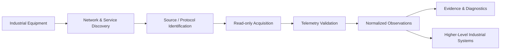
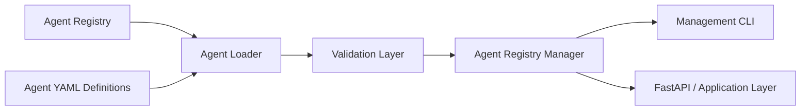
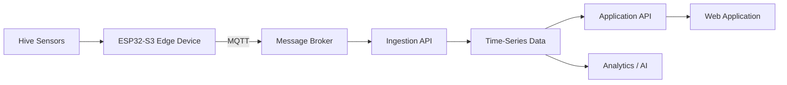
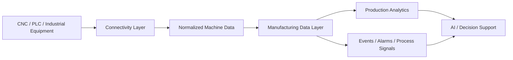

# Technical Systems — Proof of Work

This document presents selected systems and engineering decisions at a level suitable for a public portfolio.

The goal is to show **architecture, implementation depth, systems thinking and field validation discipline** without publishing proprietary implementation details.

---

## 1. Industrial Machine Connectivity Research

This work explores a recurring industrial challenge: connecting heterogeneous equipment, identifying trustworthy data sources, validating telemetry, and turning successful field investigations into reusable engineering capability.

### Generic architecture

### What the work demonstrates

- investigation of unfamiliar industrial interfaces;
- read-only connectivity and acquisition workflows;
- separation of transport evidence from semantic assumptions;
- telemetry provenance, timing and completeness checks;
- normalization into stable observations;
- repeatable diagnostics rather than one-off troubleshooting;
- conversion of field experience into structured, reusable knowledge.

### Public/private boundary

Public material intentionally excludes:

- production source code;
- internal product and module names;
- customer or facility information;
- real network addresses, credentials and deployment configuration;
- proprietary protocol details or reverse-engineered mappings;
- raw field captures that could expose confidential information.

What remains public is the **engineering method**: how to investigate, validate, reason about uncertainty and structure the result so that another engineer — or eventually an AI-assisted workflow — can reproduce the process.

### Why this matters technically

Industrial connectivity is often treated as a narrow protocol-integration problem. In practice, the harder questions are:

1. Did we find the right source?
2. Is the data structurally valid?
3. Does it remain stable under real machine behavior?
4. What does each signal actually mean?
5. Can another engineer reproduce the same diagnosis?
6. Can the successful procedure become machine-readable and reusable?

That turns connectivity from a one-off adapter task into a systems-engineering problem involving evidence, contracts, diagnostics and knowledge capture.

➡️ [Sanitized case study](./case-studies/industrial-machine-connectivity/README.md)

---

## 2. AI-Team — Multi-Agent AI Platform

AI-Team is a modular platform for defining and managing specialized AI agents as components of a larger coordinated system.

### Current implementation

The current codebase includes an Agent Definition Framework built around declarative configuration.

Each agent is represented through structured YAML files describing metadata, role, personality, skills, tools, memory configuration and agent-to-agent relations.

A central registry acts as the source of truth. Python services load and validate agent definitions, while a management CLI provides lifecycle operations.

### Current architecture

### Engineering focus

- declarative agent definitions;
- validation and lifecycle management;
- explicit tool and memory configuration;
- task delegation foundations;
- orchestration and model-routing direction;
- observability and reproducibility.

---

## 3. HiveAngel — Edge-to-Cloud IoT + AI Platform

HiveAngel is a real-world IoT platform for remote beehive monitoring. It combines embedded hardware, telemetry transport, backend ingestion, time-series storage, APIs and a SaaS interface.

### System architecture

This project demonstrates engineering across physical sensors, embedded firmware, device identity, networking, backend services, time-series data and product UI.

---

## 4. Industrial AI & Manufacturing Intelligence

My industrial systems work focuses on turning heterogeneous factory equipment into reliable, structured data for operational and analytical use.

### Typical architecture

The key engineering concern is not simply collecting more signals. It is establishing enough confidence in provenance, timing, structure and semantics that higher-level software can safely reason over the data.

---

## Engineering Principles

1. **Start from the real problem, not the technology.**
2. **Make system boundaries and data flows explicit.**
3. **Prefer working vertical slices over isolated demos.**
4. **Separate reusable architecture from confidential field configuration.**
5. **Design observability, evidence and failure handling into physical-world systems.**
6. **Convert successful one-off work into repeatable capability.**
7. **Use AI where it adds decision value, not as decoration.**

---

[← Back to GitHub profile](./README.md)
