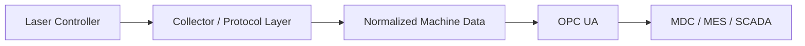
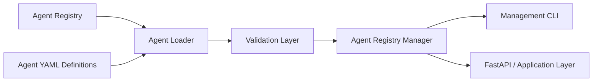
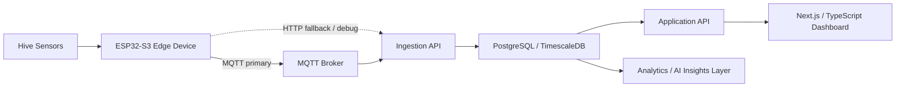
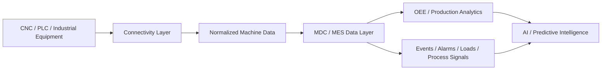

# Technical Systems — Proof of Work

This document provides a technical view of selected systems I am building and the engineering decisions behind them.

The goal is to show **architecture, implementation depth, and real-world system thinking**, not only project descriptions.

---

## 1. CypCut → OPC UA Gateway — Industrial Connectivity Case

Public repository: **[cypcut-opcua-gateway](https://github.com/Viktor-Matskevich/cypcut-opcua-gateway)**

This project explores how vendor-specific laser-controller telemetry can be normalized into a stable OPC UA interface for MDC, MES, SCADA, and manufacturing analytics systems.

### Architecture



### Public prototype

The open implementation currently includes:

- .NET 8 gateway runtime;
- configurable HTTP/JSON collection path;
- mapping into a structured OPC UA address space;
- multiple machine-specific OPC UA endpoints;
- configuration validation and self-tests;
- Windows Service deployment workflow.

### Field-validated milestone

A separate clean-room field investigation established a live CypCut/PCUI TCP connection on observed port `20112`.

The field evidence includes:

- binary frame reception and structural decoding;
- tag ID / value extraction;
- CRC validation;
- one observed run with **14,892 frames and 0 CRC errors**;
- preliminary normalized diagnostic output.

This proves the lower-level transport path and frame integrity. It does **not** yet prove the semantic mapping of machine states such as idle, run, pause, alarm, or cutting; that mapping remains active work.

### Engineering decisions

The repository deliberately distinguishes three things that are easy to conflate in integration work:

1. **what is implemented in the public prototype;**
2. **what has been observed and validated on a real machine;**
3. **what remains a hypothesis or next implementation step.**

The public release also excludes client data, private network details, proprietary monitoring-platform integration, legacy binaries, and code derived from closed-source components.

### Why this project matters technically

This is direct proof of industrial connectivity work rather than a generic architecture description. It demonstrates:

- investigation of an unfamiliar industrial interface;
- TCP/protocol analysis;
- OPC UA normalization;
- configurable multi-machine gateway design;
- field evidence collection;
- explicit clean-room and public-release boundaries.

---

## 2. AI-Team — Multi-Agent AI Platform

AI-Team is a modular platform for defining and managing specialized AI agents as components of a larger coordinated system.

### Current implementation

The current codebase includes an **Agent Definition Framework** built around declarative configuration.

Each agent is represented through structured YAML files describing:

- core metadata and role;
- personality and communication behavior;
- skills;
- available tools;
- memory configuration;
- agent-to-agent relations.

A central registry acts as the source of truth. Python services load and validate agent definitions, while a management CLI provides lifecycle operations.

### Current architecture



### Implemented engineering components

- YAML-based agent definitions;
- canonical central registry;
- schema/data models for loaded agent definitions;
- agent loading and configuration merge logic;
- automated definition and registry validation;
- agent lifecycle management;
- CLI commands to list, inspect, validate, enable, and disable agents;
- explicit model for agent relationships and memory capabilities.

### Design decision

The filesystem and declarative configuration are treated as the source of truth for agent definitions. This allows agent behavior and capabilities to change without rewriting application code.

### Next architectural layers

The current framework is the foundation for:

- Conductor / orchestration layer;
- persistent shared and agent-specific memory;
- task delegation between agents;
- tool execution policies;
- LLM routing;
- observability and agent lifecycle monitoring.

These items are architectural direction, not claimed as completed implementation.

---

## 3. HiveAngel — Edge-to-Cloud IoT + AI Platform

HiveAngel is a real-world IoT platform for remote beehive monitoring. It combines embedded hardware, telemetry transport, backend ingestion, time-series storage, APIs, and a SaaS interface.

### System architecture



### Edge / firmware

Current ESP32-S3 firmware includes:

- MQTT-first telemetry transport;
- optional HTTP fallback/debug transport;
- per-device `DEVICE_UID` and authentication token;
- device-specific MQTT topics;
- capability publication after connection/reconnection;
- batched telemetry publication;
- telemetry such as temperature, sound RMS, Wi-Fi RSSI, heap, uptime, and reconnect counters;
- PlatformIO-based firmware workflow.

A key security design decision is **per-device credentials instead of shared MQTT credentials**, allowing one compromised device to be revoked without affecting the fleet.

### Backend / ingestion

Current backend work includes:

- FastAPI ingestion services;
- asynchronous database access with SQLAlchemy;
- MQTT ingestion worker;
- device registry;
- device capability registry;
- hardware profiles;
- single and batch telemetry ingestion;
- API endpoints for devices, capabilities, hardware profiles, apiaries, and telemetry;
- smoke checks and service health foundations.

### Data layer

The system uses PostgreSQL / TimescaleDB for operational and time-series data.

The data model includes concepts such as:

- users / organizations;
- apiaries;
- hives;
- devices;
- device capabilities;
- hardware profiles;
- time-series hive metrics / raw telemetry;
- alerts;
- AI insights;
- device events.

Time-series telemetry is modeled for efficient time-based queries and future analytical workloads.

### SaaS / application layer

Current frontend work includes:

- Next.js + TypeScript application;
- dashboard and hive views;
- API adapter and backend routes;
- database-backed reads and telemetry persistence stages;
- authentication foundation;
- apiary and hive creation;
- physical-device-to-hive binding flow;
- telemetry health and auto-refresh UX;
- data visualization using Recharts.

### Why this project matters technically

HiveAngel is useful as proof-of-work because it crosses multiple engineering boundaries:

```text
physical sensors
→ embedded firmware
→ device identity
→ network transport
→ backend ingestion
→ time-series data
→ API contracts
→ SaaS product
→ analytics / AI
```

It is an example of building a system from the physical world upward rather than starting with a standalone software demo.

---

## 4. Industrial AI & Manufacturing Intelligence

My industrial systems work focuses on turning heterogeneous factory equipment into reliable, structured data for operational and analytical use.

### Typical architecture



### Engineering problems in this domain

- connecting old and new equipment through different industrial interfaces;
- normalizing machine-specific data into common models;
- collecting machine states, alarms, production counters, loads, tools, programs, and process signals;
- integrating machine data with MDC / MES / OEE workflows;
- building reliable telemetry pipelines from the shop floor to analytics;
- preparing industrial data for anomaly detection, predictive maintenance, and AI-assisted decisions.

This area represents the bridge between my long industrial background and current AI systems work.

---

## Engineering Principles

1. **Start from the real problem, not the technology.**
2. **Make system boundaries and data flows explicit.**
3. **Prefer working vertical slices over isolated demos.**
4. **Separate configuration, credentials, and environment-specific deployment details from reusable architecture.**
5. **Design observability and failure handling into physical-world systems.**
6. **Use AI where it adds decision value, not as decoration.**

---

[← Back to GitHub profile](./README.md)
