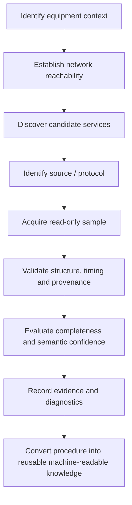

# Industrial Machine Connectivity — Sanitized Case Study

> Public portfolio material. Production implementation, internal product names, customer data, field configuration and proprietary protocol details are intentionally excluded.

## The problem

Connecting industrial equipment is often described as a protocol problem. In field work, the protocol is only one part of the task.

A reliable connection requires answering a sequence of harder questions:

- Is the machine reachable over the expected network path?
- Which services are actually available?
- Which source is authoritative?
- Can data be acquired safely in read-only mode?
- Is the data structurally valid and complete enough for the intended use?
- Does the telemetry correspond to real machine behavior?
- Can the diagnosis be reproduced by another engineer?
- Can the successful procedure become reusable knowledge rather than disappearing into one person's experience?

## Engineering approach



The objective is not to automate guessing. It is to create a workflow in which each conclusion has evidence, uncertainty is explicit, and the next action can be selected systematically.

## Architectural principle: separate evidence from interpretation

A recurring failure mode in industrial integration is to treat receiving bytes as equivalent to understanding a machine.

I separate the problem into layers:

```text
Transport evidence
    ↓
Structural decoding
    ↓
Signal observations
    ↓
Semantic hypotheses
    ↓
Field validation
    ↓
Trusted mapping
```

This prevents an early assumption about a signal from silently becoming a production truth.

## Telemetry validation

A useful machine-data pipeline should be able to answer more than "is data arriving?"

For each observation, the system should be able to reason about:

- source and provenance;
- timestamp and time quality;
- update behavior;
- structural validity;
- missing or unavailable values;
- expected ranges or state transitions;
- completeness for a defined use case;
- confidence in semantic interpretation.

This is particularly important when higher-level analytics or AI systems consume the data. An AI model can reason over incorrect telemetry very confidently, so validation belongs before intelligence.

## Public implementation evidence

The methodology above is backed by a concrete public industrial-connectivity project:

- **[CypCut → OPC UA Gateway](https://github.com/Viktor-Matskevich/cypcut-opcua-gateway)** — .NET 8 / OPC UA gateway work with a public HTTP/JSON → OPC UA prototype and sanitized field-validation evidence from a real CypCut/PCUI connectivity investigation.

The repository deliberately distinguishes what is reproducible in public code from what was validated in the field. Observed TCP/20112 frame reception, tag extraction and CRC validation are documented as field evidence; a complete public clean-room implementation of that proprietary transport is not claimed.

This separation is intentional: implementation evidence should be inspectable, while production configuration, proprietary details and unverified semantics remain private.

## Field correlation

One research direction is synchronized evidence capture: recording machine telemetry while separately capturing observable machine or HMI behavior.

```text
Machine telemetry ───────┐
                         ├── Time-aligned evidence → analysis
Machine / HMI observation ┘
```

The purpose is to compare what the data claims with what the physical system is actually doing and use that evidence to refine semantic mappings.

## From troubleshooting to reusable capability

Traditional workflow:

```text
Engineer
  → reads manuals
  → checks network
  → tries vendor tools
  → finds working source
  → interprets data
  → solves local problem
  → much of the knowledge remains implicit
```

Target workflow:

```text
Field investigation
  → structured evidence
  → explicit diagnostic procedure
  → machine-readable knowledge
  → reusable capability
  → AI-assisted engineer
```

The long-term engineering question is whether an AI agent can eventually choose the next safe diagnostic action, execute permitted checks, evaluate evidence, and explain the result to a human engineer.

## Design constraints

The work is guided by several constraints:

1. **Read-only by default.** Connectivity diagnostics should not write to industrial equipment unless explicitly authorized.
2. **Vendor logic stays modular.** General workflow should remain portable across different machine and controller families.
3. **Confidential configuration stays local.** Public knowledge should not require customer IP addresses, credentials or proprietary plant data.
4. **Evidence must be reproducible.** Diagnostics should produce enough structured evidence for another engineer to verify the conclusion.
5. **A successful field connection should become a reusable capability, not a one-off fix.**

## What is intentionally not published

This public case study does **not** contain:

- production source code;
- internal product or module names;
- real network addresses or credentials;
- customer or facility information;
- raw proprietary protocol captures;
- reverse-engineered tag maps;
- deployment-specific configuration;
- confidential architecture of the production system.

The purpose of the repository is to demonstrate systems thinking, field engineering method, validation discipline and AI-agent architecture direction without exposing implementation IP.

## Why this matters

Industrial AI depends on trustworthy connections to the physical world. Before prediction, optimization or autonomous decisions, a system needs to know where its data came from, whether it is complete, and whether the semantics have actually been validated.

That makes machine connectivity not just an integration problem, but a foundation for trustworthy industrial intelligence.

---

[← Back to profile](../../README.md)
